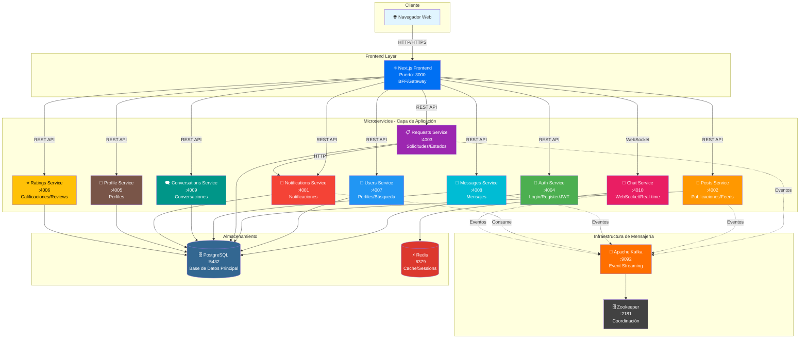
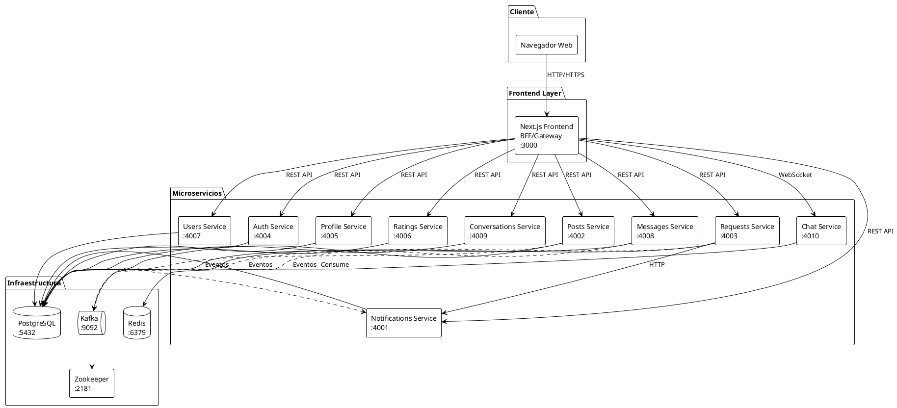

# Diagrama de Arquitectura de Alto Nivel

## Descripción
Este diagrama muestra la arquitectura general del sistema Request App, incluyendo todos los microservicios, el frontend, y la infraestructura de soporte.

## Diagrama Mermaid

## Diagrama PlantUML

## Leyenda

- **Líneas sólidas**: Comunicación síncrona (HTTP/REST)
- **Líneas punteadas**: Comunicación asíncrona (Eventos Kafka)
- **Puertos**: Cada servicio expone un puerto específico
- **Colores**: Diferentes colores para identificar tipos de servicios

## Notas Técnicas

1. **Next.js como BFF**: El frontend Next.js actúa como Backend for Frontend, manejando la composición de datos y el enrutamiento a microservicios.

2. **Comunicación Síncrona vs Asíncrona**:
   - Síncrona: Para operaciones que requieren respuesta inmediata (CRUD básico)
   - Asíncrona: Para eventos que no requieren respuesta inmediata (notificaciones, actualizaciones de estado)

3. **Base de Datos Compartida**: Actualmente todos los servicios comparten PostgreSQL. En producción, cada servicio debería tener su propia base de datos.

4. **Kafka para Eventos**: Se usa para desacoplar servicios y permitir escalabilidad horizontal.

