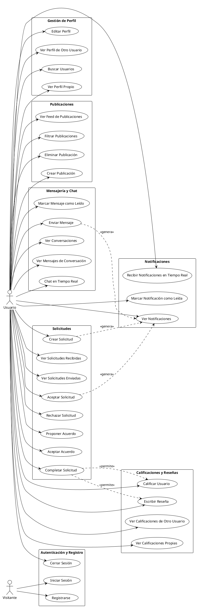

# Diagrama de Casos de Uso

## Descripción
Este diagrama muestra los principales casos de uso del sistema Request App desde la perspectiva de los usuarios finales.

## Diagrama Mermaid

```mermaid
graph TB
    User((👤 Usuario))
    Guest((👤 Visitante))

    subgraph "Autenticación y Registro"
        UC1[Registrarse]
        UC2[Iniciar Sesión]
        UC3[Cerrar Sesión]
    end

    subgraph "Gestión de Perfil"
        UC4[Ver Perfil Propio]
        UC5[Editar Perfil]
        UC6[Ver Perfil de Otro Usuario]
        UC7[Buscar Usuarios]
    end

    subgraph "Publicaciones"
        UC8[Crear Publicación]
        UC9[Ver Feed de Publicaciones]
        UC10[Filtrar Publicaciones]
        UC11[Eliminar Publicación]
    end

    subgraph "Solicitudes"
        UC12[Crear Solicitud]
        UC13[Ver Solicitudes Recibidas]
        UC14[Ver Solicitudes Enviadas]
        UC15[Aceptar Solicitud]
        UC16[Rechazar Solicitud]
        UC17[Proponer Acuerdo]
        UC18[Aceptar Acuerdo]
        UC19[Completar Solicitud]
    end

    subgraph "Mensajería y Chat"
        UC20[Enviar Mensaje]
        UC21[Ver Conversaciones]
        UC22[Ver Mensajes de Conversación]
        UC23[Chat en Tiempo Real]
        UC24[Marcar Mensaje como Leído]
    end

    subgraph "Calificaciones y Reseñas"
        UC25[Calificar Usuario]
        UC26[Escribir Reseña]
        UC27[Ver Calificaciones Propias]
        UC28[Ver Calificaciones de Otro Usuario]
    end

    subgraph "Notificaciones"
        UC29[Ver Notificaciones]
        UC30[Marcar Notificación como Leída]
        UC31[Recibir Notificaciones en Tiempo Real]
    end

    Guest --> UC1
    Guest --> UC2
    User --> UC3
    User --> UC4
    User --> UC5
    User --> UC6
    User --> UC7
    User --> UC8
    User --> UC9
    User --> UC10
    User --> UC11
    User --> UC12
    User --> UC13
    User --> UC14
    User --> UC15
    User --> UC16
    User --> UC17
    User --> UC18
    User --> UC19
    User --> UC20
    User --> UC21
    User --> UC22
    User --> UC23
    User --> UC24
    User --> UC25
    User --> UC26
    User --> UC27
    User --> UC28
    User --> UC29
    User --> UC30
    User --> UC31

    UC12 -.->|Genera| UC29
    UC15 -.->|Genera| UC29
    UC20 -.->|Genera| UC29
    UC19 -.->|Permite| UC25
    UC19 -.->|Permite| UC26

    style User fill:#4caf50,color:#fff
    style Guest fill:#ff9800,color:#fff
    style UC1 fill:#e3f2fd
    style UC2 fill:#e3f2fd
    style UC3 fill:#e3f2fd
    style UC4 fill:#f3e5f5
    style UC5 fill:#f3e5f5
    style UC6 fill:#f3e5f5
    style UC7 fill:#f3e5f5
    style UC8 fill:#e8f5e9
    style UC9 fill:#e8f5e9
    style UC10 fill:#e8f5e9
    style UC11 fill:#e8f5e9
    style UC12 fill:#fff3e0
    style UC13 fill:#fff3e0
    style UC14 fill:#fff3e0
    style UC15 fill:#fff3e0
    style UC16 fill:#fff3e0
    style UC17 fill:#fff3e0
    style UC18 fill:#fff3e0
    style UC19 fill:#fff3e0
    style UC20 fill:#e0f2f1
    style UC21 fill:#e0f2f1
    style UC22 fill:#e0f2f1
    style UC23 fill:#e0f2f1
    style UC24 fill:#e0f2f1
    style UC25 fill:#fff9c4
    style UC26 fill:#fff9c4
    style UC27 fill:#fff9c4
    style UC28 fill:#fff9c4
    style UC29 fill:#fce4ec
    style UC30 fill:#fce4ec
    style UC31 fill:#fce4ec
```

## Diagrama PlantUML

## Descripción de Casos de Uso Principales

### Autenticación y Registro
- **Registrarse**: Un visitante puede crear una cuenta nueva
- **Iniciar Sesión**: Usuario autenticado puede acceder al sistema
- **Cerrar Sesión**: Usuario puede cerrar su sesión

### Gestión de Perfil
- **Ver/Editar Perfil**: Usuario puede ver y modificar su información personal
- **Buscar Usuarios**: Buscar otros usuarios por nombre, carrera, habilidades

### Publicaciones
- **Crear/Ver/Eliminar Publicaciones**: Gestión completa del feed de publicaciones
- **Filtrar**: Por tipo (trabajo, proyecto, colaboración) y carrera

### Solicitudes
- **Ciclo completo**: Crear → Aceptar/Rechazar → Proponer Acuerdo → Completar
- **Estados**: PENDING → ACCEPTED → COMPLETED

### Mensajería
- **Chat en tiempo real**: Comunicación instantánea entre usuarios
- **Historial**: Ver conversaciones y mensajes anteriores

### Calificaciones
- **Solo después de completar**: Las calificaciones se dan al completar una solicitud
- **Reseñas**: Comentarios adicionales junto con la calificación

### Notificaciones
- **Tiempo real**: Notificaciones push cuando ocurren eventos relevantes
- **Tipos**: Nuevo mensaje, solicitud recibida, solicitud aceptada, etc.

