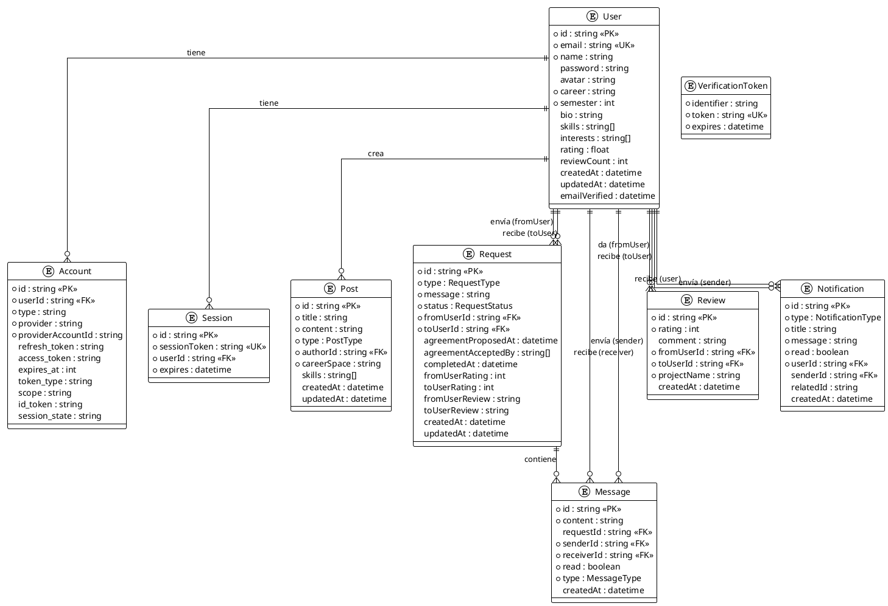

# Diagrama de Base de Datos (Modelo Entidad-Relación)

## Descripción
Este diagrama muestra el modelo de datos completo del sistema Request App, incluyendo todas las entidades, relaciones y atributos principales.

## Diagrama Mermaid

```mermaid
erDiagram
    User ||--o{ Account : "tiene"
    User ||--o{ Session : "tiene"
    User ||--o{ Post : "crea"
    User ||--o{ Request : "envía"
    User ||--o{ Request : "recibe"
    User ||--o{ Message : "envía"
    User ||--o{ Message : "recibe"
    User ||--o{ Notification : "recibe"
    User ||--o{ Notification : "envía"
    User ||--o{ Review : "da"
    User ||--o{ Review : "recibe"

    Request ||--o{ Message : "contiene"
    
    User {
        string id PK
        string email UK
        string name
        string password
        string avatar
        string career
        int semester
        string bio
        string[] skills
        string[] interests
        float rating
        int reviewCount
        datetime createdAt
        datetime updatedAt
        datetime emailVerified
    }

    Account {
        string id PK
        string userId FK
        string type
        string provider
        string providerAccountId
        string refresh_token
        string access_token
        int expires_at
        string token_type
        string scope
        string id_token
        string session_state
    }

    Session {
        string id PK
        string sessionToken UK
        string userId FK
        datetime expires
    }

    Post {
        string id PK
        string title
        string content
        enum PostType type
        string authorId FK
        string careerSpace
        string[] skills
        datetime createdAt
        datetime updatedAt
    }

    Request {
        string id PK
        enum RequestType type
        string message
        enum RequestStatus status
        string fromUserId FK
        string toUserId FK
        datetime agreementProposedAt
        string[] agreementAcceptedBy
        datetime completedAt
        int fromUserRating
        int toUserRating
        string fromUserReview
        string toUserReview
        datetime createdAt
        datetime updatedAt
    }

    Message {
        string id PK
        string content
        string requestId FK
        string senderId FK
        string receiverId FK
        boolean read
        enum MessageType type
        datetime createdAt
    }

    Review {
        string id PK
        int rating
        string comment
        string fromUserId FK
        string toUserId FK
        string projectName
        datetime createdAt
    }

    Notification {
        string id PK
        enum NotificationType type
        string title
        string message
        boolean read
        string userId FK
        string senderId FK
        string relatedId
        datetime createdAt
    }

    VerificationToken {
        string identifier
        string token UK
        datetime expires
    }
```

## Diagrama PlantUML



## Descripción de Entidades

### User (Usuario)
- **Descripción**: Entidad central que representa a los usuarios del sistema
- **Relaciones**:
  - 1:N con Account (múltiples métodos de autenticación)
  - 1:N con Session (múltiples sesiones activas)
  - 1:N con Post (puede crear múltiples publicaciones)
  - 1:N con Request (puede enviar y recibir solicitudes)
  - 1:N con Message (puede enviar y recibir mensajes)
  - 1:N con Notification (puede recibir múltiples notificaciones)
  - 1:N con Review (puede dar y recibir calificaciones)

### Account
- **Descripción**: Cuentas de autenticación externa (OAuth, etc.)
- **Relación**: N:1 con User

### Session
- **Descripción**: Sesiones activas de usuarios
- **Relación**: N:1 con User

### Post
- **Descripción**: Publicaciones en el feed (trabajos, proyectos, colaboraciones)
- **Tipos**: JOB, PROJECT, COLLABORATION, ENTREPRENEURSHIP, ANNOUNCEMENT
- **Relación**: N:1 con User (author)

### Request
- **Descripción**: Solicitudes entre usuarios
- **Tipos**: COLLABORATION, ADVICE, JOB_OFFER, MENTORSHIP
- **Estados**: PENDING, ACCEPTED, REJECTED, COMPLETED
- **Relaciones**:
  - N:1 con User (fromUser - quien envía)
  - N:1 con User (toUser - quien recibe)
  - 1:N con Message (mensajes asociados a la solicitud)

### Message
- **Descripción**: Mensajes entre usuarios
- **Tipos**: TEXT, AGREEMENT_PROPOSAL, AGREEMENT_ACCEPTED, AGREEMENT_REJECTED, RATING_REQUEST
- **Relaciones**:
  - N:1 con User (sender)
  - N:1 con User (receiver)
  - N:1 con Request (opcional, si está asociado a una solicitud)

### Review
- **Descripción**: Calificaciones y reseñas entre usuarios
- **Relaciones**:
  - N:1 con User (fromUser - quien califica)
  - N:1 con User (toUser - quien recibe la calificación)

### Notification
- **Descripción**: Notificaciones del sistema
- **Tipos**: NEW_MESSAGE, REQUEST_RECEIVED, REQUEST_ACCEPTED, REQUEST_REJECTED, AGREEMENT_PROPOSAL, AGREEMENT_ACCEPTED, AGREEMENT_REJECTED, RATING_RECEIVED, PROJECT_COMPLETED
- **Relaciones**:
  - N:1 con User (user - quien recibe)
  - N:1 con User (sender - opcional, quien genera la notificación)

### VerificationToken
- **Descripción**: Tokens para verificación de email
- **Sin relaciones directas** (tabla independiente)

## Índices Importantes

- `User.email`: Único (UK)
- `Notification.userId`: Índice para búsquedas rápidas
- `Notification(userId, read)`: Índice compuesto para notificaciones no leídas
- `Notification.createdAt`: Índice para ordenamiento temporal

## Notas de Diseño

1. **Soft Delete**: No hay eliminación física, solo lógica mediante estados
2. **Timestamps**: Todas las entidades principales tienen `createdAt` y `updatedAt`
3. **Arrays**: PostgreSQL permite arrays nativos para `skills`, `interests`, `agreementAcceptedBy`
4. **Enums**: Se usan enums de Prisma para tipos y estados
5. **Cascadas**: Las relaciones tienen `onDelete: Cascade` para mantener integridad referencial


