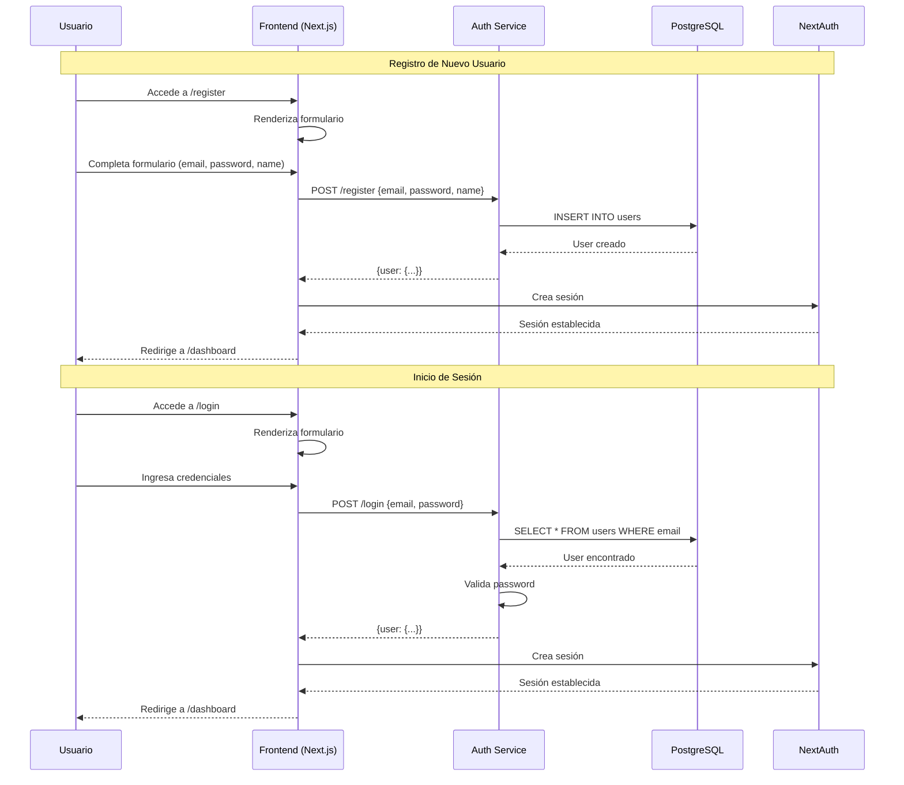
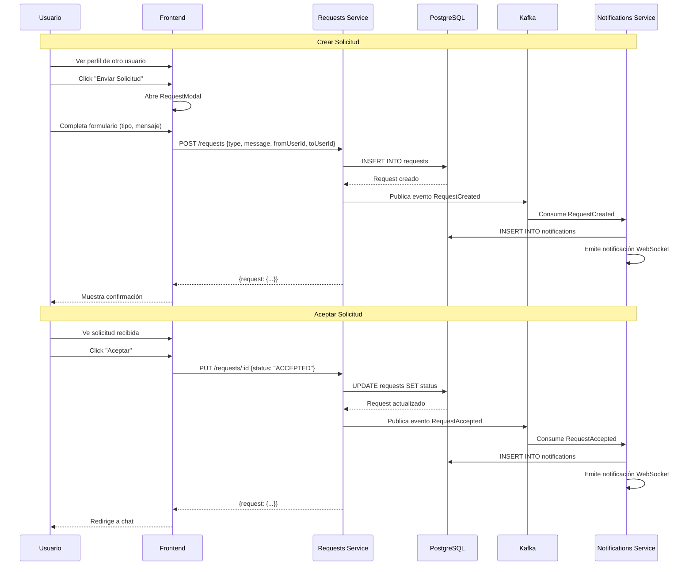
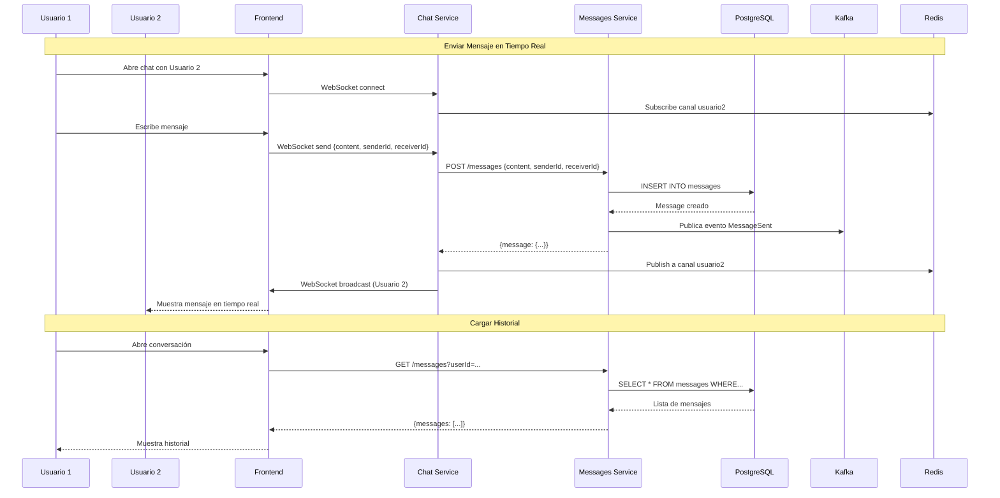
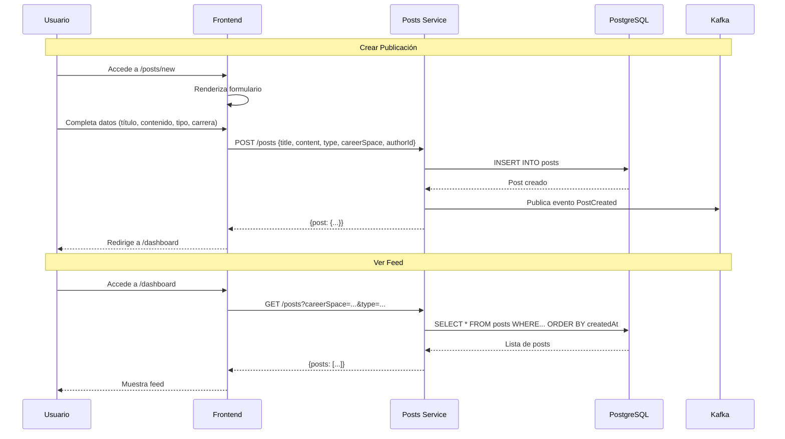
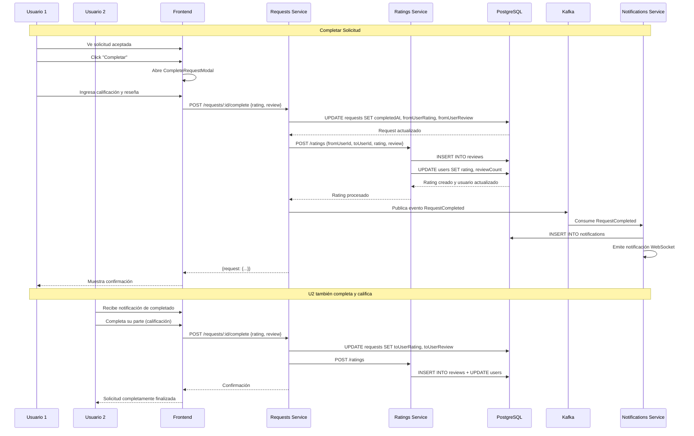
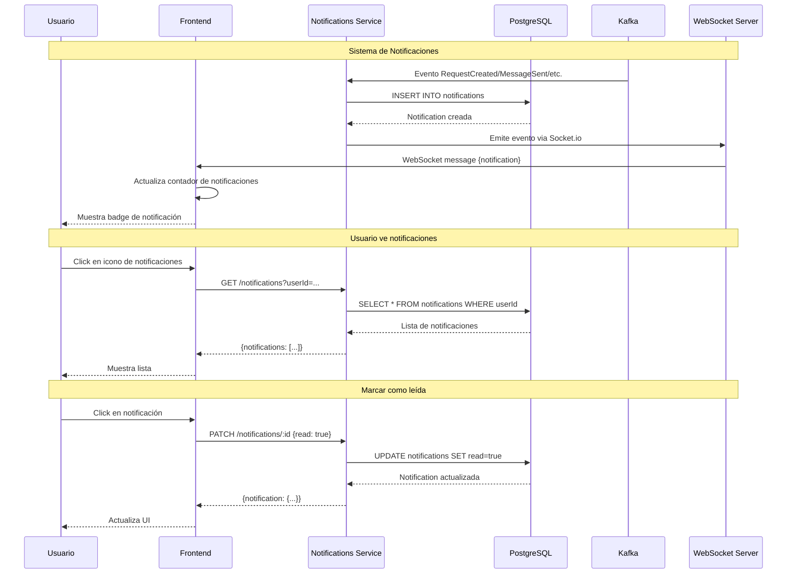
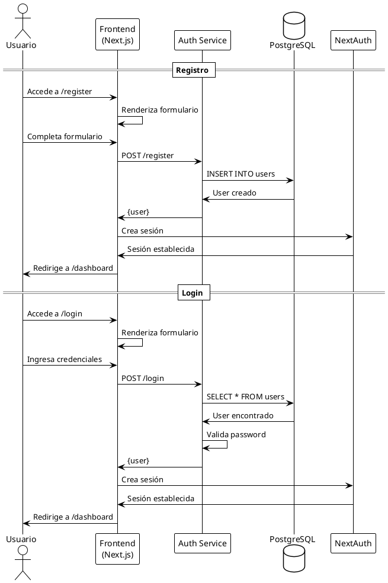
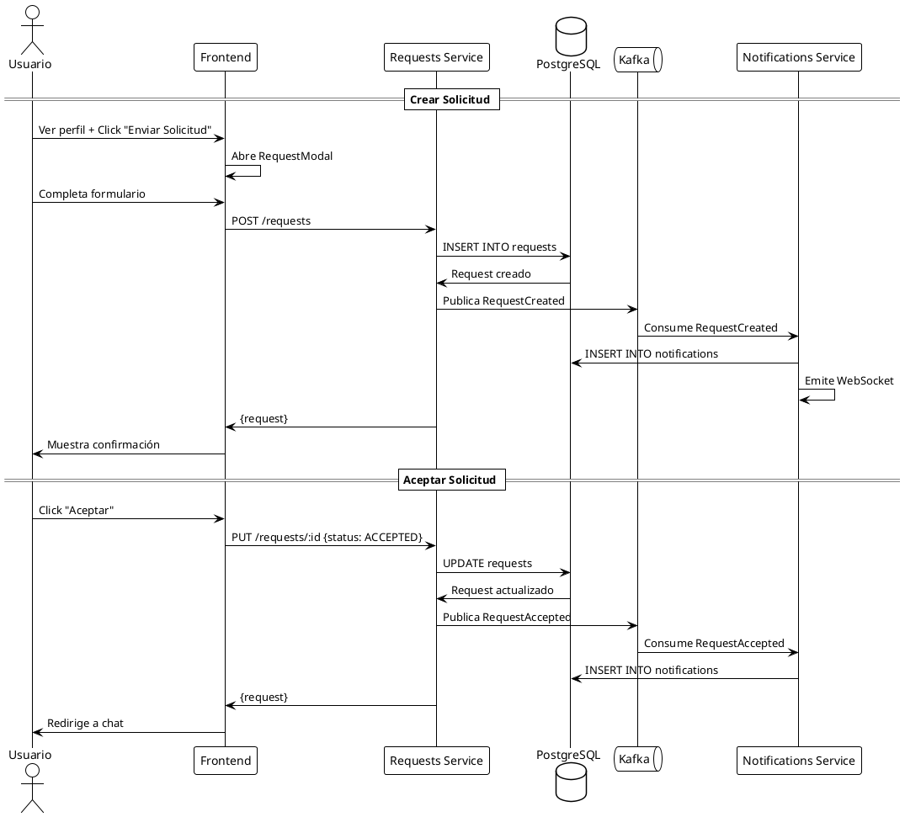

# Diagramas de Secuencia

## Descripción
Este documento contiene los diagramas de secuencia para los flujos principales del sistema Request App.

## 1. Flujo de Autenticación y Registro

## 2. Flujo de Creación y Gestión de Solicitudes

## 3. Flujo de Mensajería y Chat

## 4. Flujo de Publicaciones y Feed

## 5. Flujo de Completar Solicitud y Calificación

## 6. Flujo de Notificaciones en Tiempo Real

## Diagramas PlantUML

### Flujo de Autenticación

### Flujo de Solicitudes

