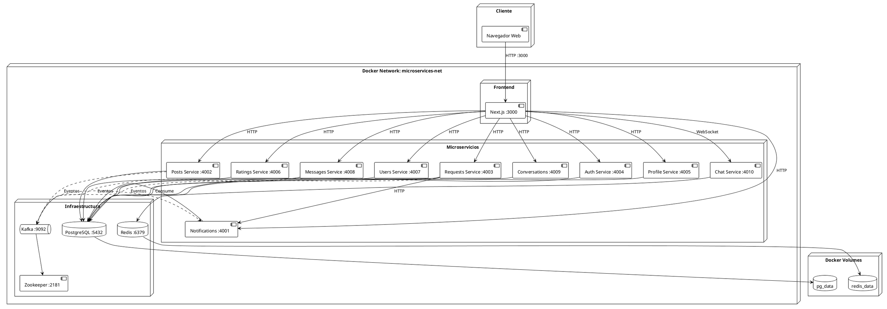

# Diagrama de Despliegue e Infraestructura

## Descripción
Este diagrama muestra la arquitectura de despliegue del sistema Request App, incluyendo contenedores Docker, redes, volúmenes y comunicación entre servicios.

## Diagrama Mermaid

```mermaid
graph TB
    subgraph "Cliente"
        Browser[🌐 Navegador Web<br/>Usuario Final]
    end

    subgraph "Docker Network: microservices-net"
        subgraph "Frontend Container"
            NextJS[⚛️ Next.js<br/>Puerto: 3000<br/>Container: nextjs-app]
        end

        subgraph "Microservicios Containers"
            AuthSvc[🔐 Auth Service<br/>:4004<br/>auth-service]
            UsersSvc[👤 Users Service<br/>:4007<br/>users-service]
            PostsSvc[📝 Posts Service<br/>:4002<br/>posts-service]
            RequestsSvc[📋 Requests Service<br/>:4003<br/>requests-service]
            MessagesSvc[💬 Messages Service<br/>:4008<br/>messages-service]
            ConversationsSvc[🗨️ Conversations<br/>:4009<br/>conversations-service]
            ChatSvc[💭 Chat Service<br/>:4010<br/>chat-service]
            NotificationsSvc[🔔 Notifications<br/>:4001<br/>notification-service]
            ProfileSvc[👔 Profile Service<br/>:4005<br/>profile-service]
            RatingsSvc[⭐ Ratings Service<br/>:4006<br/>ratings-service]
        end

        subgraph "Infraestructura"
            Zookeeper[🗄️ Zookeeper<br/>:2181<br/>zookeeper]
            Kafka[📨 Kafka<br/>:9092 (interno)<br/>:29092 (host)<br/>kafka]
            PostgreSQL[(🗄️ PostgreSQL<br/>:5432<br/>postgres<br/>DB: requestdb)]
            Redis[(⚡ Redis<br/>:6379<br/>redis)]
        end
    end

    subgraph "Docker Volumes"
        PGVolume[(pg_data<br/>PostgreSQL Data)]
        RedisVolume[(redis_data<br/>Redis Data)]
    end

    Browser -->|HTTP :3000| NextJS

    NextJS -->|HTTP :4004| AuthSvc
    NextJS -->|HTTP :4007| UsersSvc
    NextJS -->|HTTP :4002| PostsSvc
    NextJS -->|HTTP :4003| RequestsSvc
    NextJS -->|HTTP :4008| MessagesSvc
    NextJS -->|HTTP :4009| ConversationsSvc
    NextJS -->|WebSocket :4010| ChatSvc
    NextJS -->|HTTP :4001| NotificationsSvc
    NextJS -->|HTTP :4005| ProfileSvc
    NextJS -->|HTTP :4006| RatingsSvc

    RequestsSvc -->|HTTP :4001| NotificationsSvc
    RequestsSvc -.->|Eventos| Kafka
    PostsSvc -.->|Eventos| Kafka
    MessagesSvc -.->|Eventos| Kafka
    NotificationsSvc -.->|Consume| Kafka
    ChatSvc -.->|Eventos| Kafka

    Kafka --> Zookeeper

    AuthSvc --> PostgreSQL
    UsersSvc --> PostgreSQL
    PostsSvc --> PostgreSQL
    RequestsSvc --> PostgreSQL
    MessagesSvc --> PostgreSQL
    ConversationsSvc --> PostgreSQL
    NotificationsSvc --> PostgreSQL
    ProfileSvc --> PostgreSQL
    RatingsSvc --> PostgreSQL
    ChatSvc --> Redis

    PostgreSQL --> PGVolume
    Redis --> RedisVolume

    style Browser fill:#e1f5ff
    style NextJS fill:#0070f3,color:#fff
    style AuthSvc fill:#4caf50,color:#fff
    style UsersSvc fill:#2196f3,color:#fff
    style PostsSvc fill:#ff9800,color:#fff
    style RequestsSvc fill:#9c27b0,color:#fff
    style MessagesSvc fill:#00bcd4,color:#fff
    style ConversationsSvc fill:#009688,color:#fff
    style ChatSvc fill:#e91e63,color:#fff
    style NotificationsSvc fill:#f44336,color:#fff
    style ProfileSvc fill:#795548,color:#fff
    style RatingsSvc fill:#ffc107,color:#000
    style Kafka fill:#ff6f00,color:#fff
    style Zookeeper fill:#424242,color:#fff
    style PostgreSQL fill:#336791,color:#fff
    style Redis fill:#dc382d,color:#fff
    style PGVolume fill:#e0e0e0
    style RedisVolume fill:#e0e0e0
```

## Diagrama PlantUML



## Configuración de Despliegue

### Docker Compose

El sistema se despliega usando `docker-compose.yaml` con la siguiente estructura:

```yaml
services:
  # Infraestructura
  - zookeeper (puerto 2181)
  - kafka (puertos 9092 interno, 29092 host)
  - postgres (puerto 5432)
  - redis (puerto 6379)
  
  # Microservicios
  - notification-service (puerto 4001)
  - posts-service (puerto 4002)
  - requests-service (puerto 4003)
  - auth-service (puerto 4004)
  - profile-service (puerto 4005)
  - ratings-service (puerto 4006)
  - users-service (puerto 4007)
  - messages-service (puerto 4008)
  - conversations-service (puerto 4009)
  - chat-service (puerto 4010)
```

### Red Docker

- **Nombre**: `microservices-net` (bridge network)
- **Aliases**: Cada servicio tiene un alias para comunicación interna
  - `kafka-broker` para Kafka
  - `postgres-db` para PostgreSQL
  - `redis-cache` para Redis

### Volúmenes Persistentes

1. **pg_data**: Almacena datos de PostgreSQL
2. **redis_data**: Almacena datos de Redis

### Puertos Expuestos

#### Al Host (desde fuera de Docker):
- `3000`: Next.js Frontend
- `29092`: Kafka (externo)
- `5432`: PostgreSQL
- `6379`: Redis
- `4001-4010`: Microservicios

#### Internos (dentro de Docker network):
- `9092`: Kafka (interno)
- `2181`: Zookeeper
- Todos los servicios se comunican usando nombres de contenedor

### Health Checks

Los servicios incluyen health checks:
- **PostgreSQL**: `pg_isready -U postgres`
- **Kafka**: `kafka-topics --list --bootstrap-server kafka:9092`

### Dependencias

Los servicios tienen dependencias configuradas:
- Todos los microservicios dependen de PostgreSQL (health check)
- Servicios que usan Kafka dependen de Kafka (health check)
- Chat Service depende de Redis

### Variables de Entorno

Cada servicio requiere:
- `DATABASE_URL`: Connection string de PostgreSQL
- `KAFKA_BROKER`: Dirección de Kafka (kafka:9092 en Docker)
- `PORT`: Puerto del servicio
- `NODE_ENV`: Entorno (development/production)

## Comandos de Despliegue

```bash
# Levantar todos los servicios
docker compose up --build

# Levantar en background
docker compose up -d

# Ver logs
docker compose logs -f [service-name]

# Detener servicios
docker compose down

# Detener y eliminar volúmenes
docker compose down -v
```

## Escalabilidad

### Escalado Horizontal

Cada microservicio puede escalarse independientemente:

```bash
docker compose up --scale requests-service=3
docker compose up --scale chat-service=2
```

### Consideraciones

1. **PostgreSQL**: Compartido actualmente. En producción, cada servicio debería tener su propia DB.
2. **Kafka**: Soporta múltiples brokers para alta disponibilidad.
3. **Redis**: Puede configurarse en modo cluster.
4. **Load Balancing**: Se requiere un load balancer (NGINX, Traefik) para distribuir carga entre instancias.

## Monitoreo y Observabilidad

### Logs
- Logs centralizados: `docker compose logs`
- Logs por servicio: `docker compose logs [service-name]`

### Métricas (Futuro)
- Prometheus para métricas
- Grafana para visualización
- Jaeger para tracing distribuido

## Seguridad

1. **Red Aislada**: Todos los servicios en red Docker privada
2. **Puertos Expuestos**: Solo los necesarios están expuestos al host
3. **Variables de Entorno**: Credenciales via environment variables
4. **TLS**: En producción, usar HTTPS/TLS para comunicación


