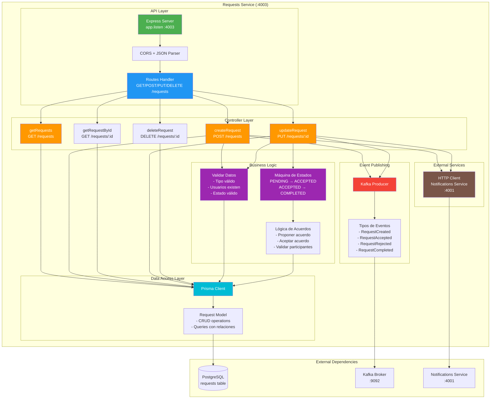
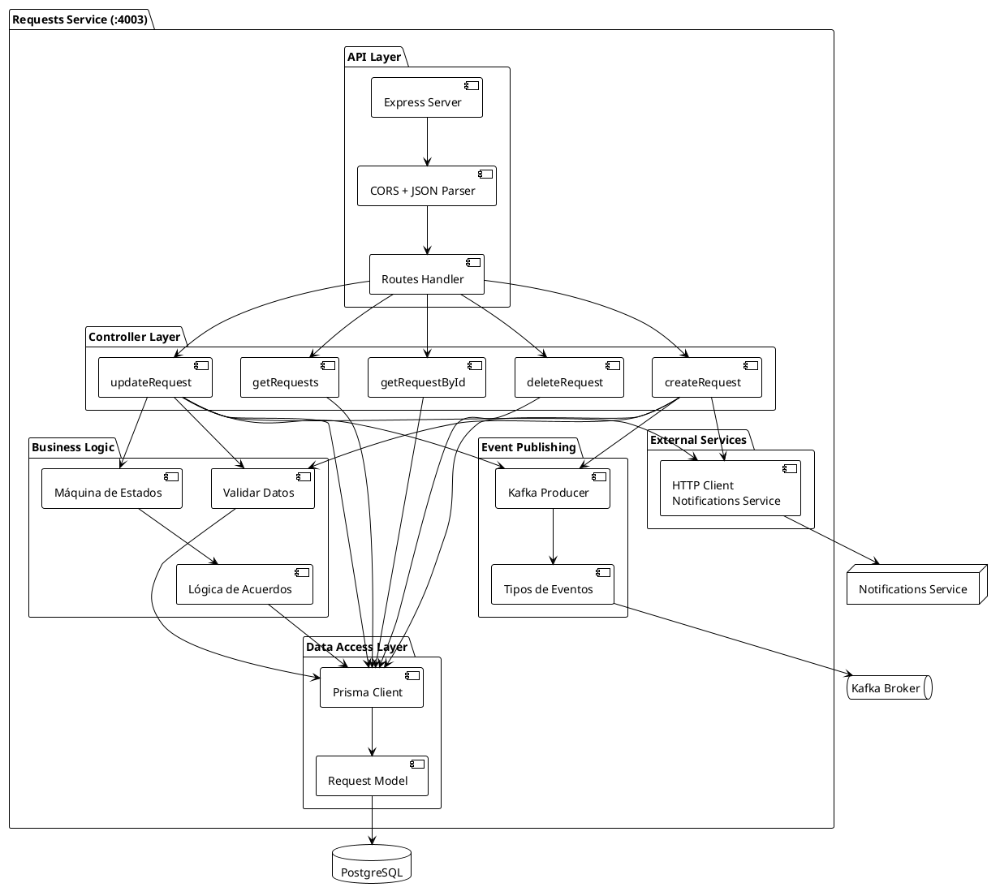
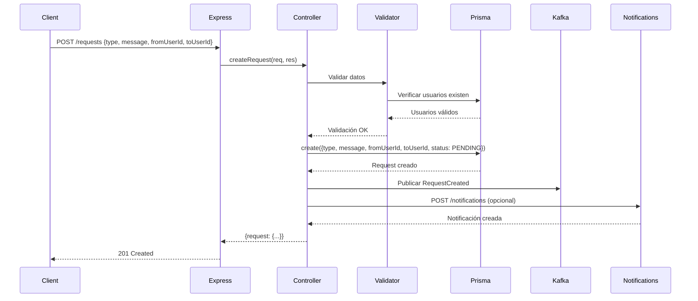
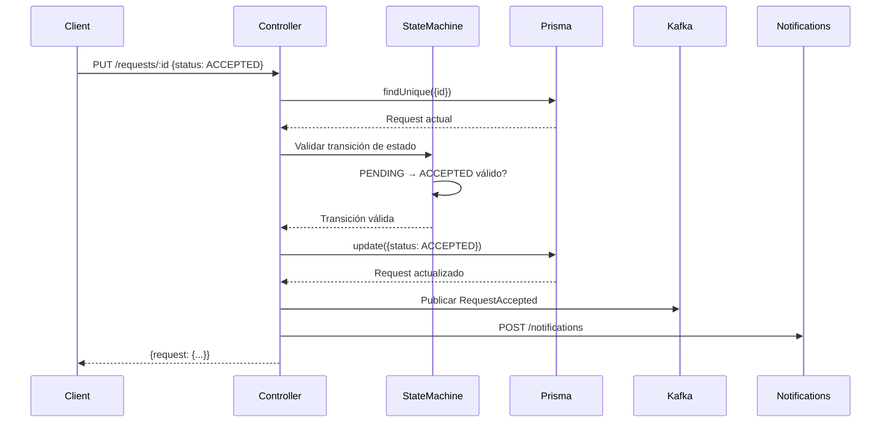
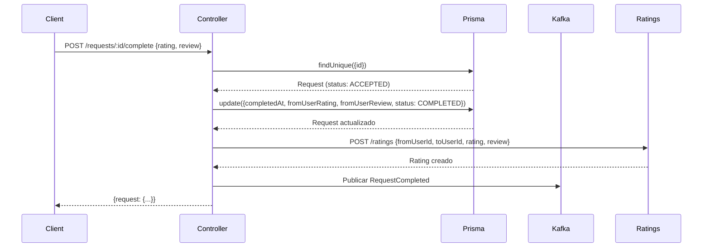

# Diagrama de Bajo Nivel - Requests Service

## Descripción
Este diagrama muestra la arquitectura interna detallada del Requests Service, incluyendo controladores, lógica de negocio, acceso a datos y comunicación con otros servicios.

## Diagrama Mermaid



## Diagrama PlantUML



## Flujo Detallado de Operaciones

### 1. Crear Solicitud (POST /requests)



### 2. Actualizar Estado de Solicitud (PUT /requests/:id)



### 3. Completar Solicitud con Calificación



## Estructura de Código

```
requests-service/
├── src/
│   ├── index.ts                 # Express server setup
│   ├── controllers/
│   │   └── requestsController.ts # Controladores
│   ├── prisma.ts                 # Prisma client
│   ├── kafka.ts                  # Kafka producer setup
│   └── types/
│       └── request.types.ts      # TypeScript types
├── prisma/
│   └── schema.prisma            # Schema de Request
├── Dockerfile
├── package.json
└── tsconfig.json
```

## Modelo de Datos

```typescript
model Request {
  id                  String        @id @default(cuid())
  type                RequestType
  message             String
  status              RequestStatus @default(PENDING)
  fromUserId          String
  toUserId            String
  agreementProposedAt DateTime?
  agreementAcceptedBy String[]
  completedAt         DateTime?
  fromUserRating      Int?
  toUserRating        Int?
  fromUserReview      String?
  toUserReview        String?
  createdAt           DateTime      @default(now())
  updatedAt           DateTime      @updatedAt
  messages            Message[]
  fromUser            User          @relation("SentRequests")
  toUser              User          @relation("ReceivedRequests")
}
```

## Eventos Kafka

### RequestCreated
```json
{
  "eventType": "RequestCreated",
  "requestId": "clx...",
  "fromUserId": "user1",
  "toUserId": "user2",
  "type": "COLLABORATION",
  "timestamp": "2025-01-15T10:00:00Z"
}
```

### RequestAccepted
```json
{
  "eventType": "RequestAccepted",
  "requestId": "clx...",
  "acceptedBy": "user2",
  "timestamp": "2025-01-15T10:05:00Z"
}
```

### RequestCompleted
```json
{
  "eventType": "RequestCompleted",
  "requestId": "clx...",
  "fromUserRating": 5,
  "toUserRating": 4,
  "timestamp": "2025-01-15T10:30:00Z"
}
```

## Validaciones de Negocio

1. **Crear Solicitud**:
   - `fromUserId` y `toUserId` deben existir
   - `fromUserId` ≠ `toUserId`
   - `type` debe ser válido (enum)
   - `message` no puede estar vacío

2. **Actualizar Estado**:
   - Solo transiciones válidas:
     - PENDING → ACCEPTED
     - PENDING → REJECTED
     - ACCEPTED → COMPLETED
   - Solo el `toUser` puede aceptar/rechazar
   - Solo participantes pueden completar

3. **Acuerdos**:
   - Solo se puede proponer si status = ACCEPTED
   - Ambos usuarios deben aceptar para que sea válido
   - Se almacena en `agreementAcceptedBy[]`

## Integraciones

### Con Notifications Service
- Llamada HTTP directa para notificaciones críticas
- También se publican eventos a Kafka para eventual consistency

### Con Kafka
- Producer para eventos de dominio
- Topics: `requests.created`, `requests.accepted`, `requests.completed`

### Con PostgreSQL
- Prisma ORM para acceso a datos
- Transacciones para operaciones atómicas
- Índices en `fromUserId`, `toUserId`, `status`


